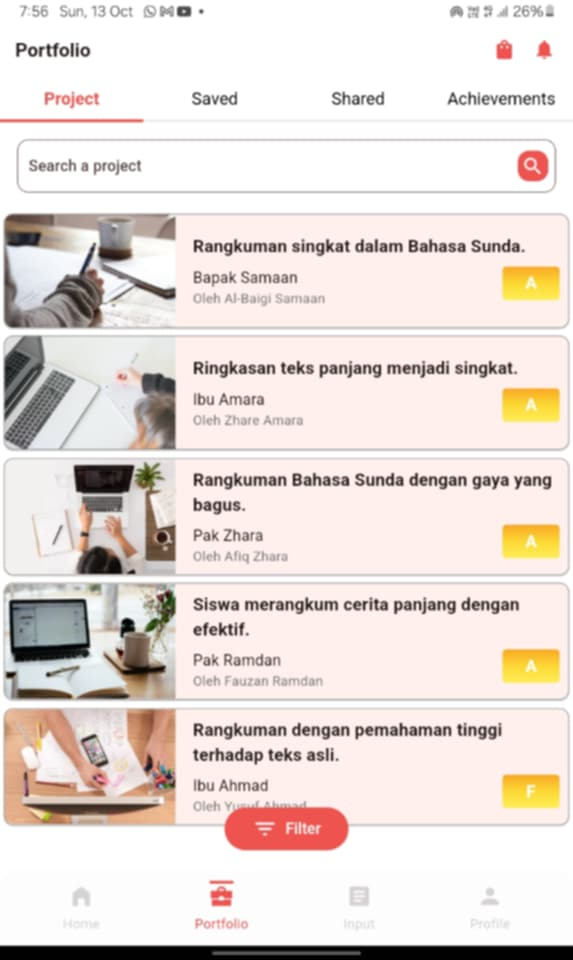

# Student Portfolio App

This is a Flutter app that showcases a UI design built with Flutter and a Figma file.

## Screenshots

### Portfolio Screen

## Figma File

The Figma file for this app can be found in the `figma_file` folder.

## Online Version

You can view the app online at [https://mg3994.github.io/student__portfolio/](https://mg3994.github.io/student__portfolio/).

## Figma Design

You can view the Figma design for this app at [https://www.figma.com/design/bvGltb1AuJMeI4e1kA24zZ/design-test](https://www.figma.com/design/bvGltb1AuJMeI4e1kA24zZ/design-test).

## Source Code

The source code for this app can be found at [https://github.com/mg3994/student-portfolio](https://github.com/mg3994/student-portfolio).

## How to Run

1. Clone the repository.
2. Open the project in Android Studio.
3. Run the app on a physical device or emulator.

## Features

* A home screen that displays a list of students.
* A details screen that displays information about a selected student.
* A floating action button that navigates to the details screen.

## Tech Stack

* Flutter
* Dart
* Figma

## License

This project is licensed under the MIT License. See the LICENSE file for details.
